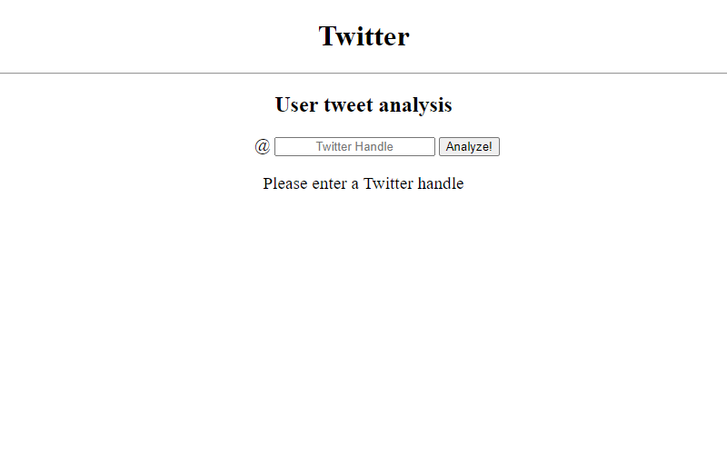
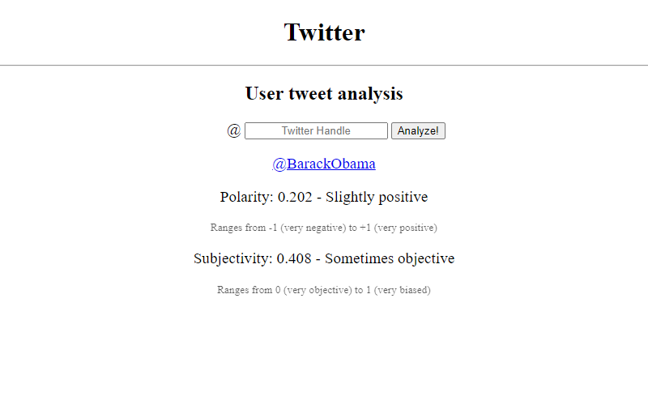
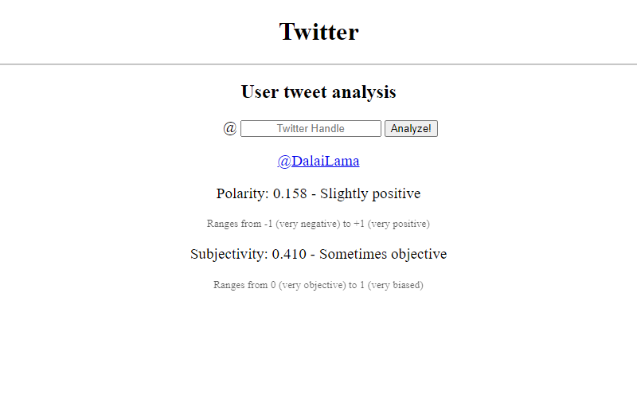

# BrickHack7
Project for BrickHack7 Hackathon.
### Analyze a twitter users subjectivity and positivity.
Server hosted on an AWS EC2 instance.

The twint library that is used by the server script works by web scraping. Following the 2020 presidential election, Twitter made massive changes to their API, breaking other tools and leaving Twint as the only functioning option. Twitter's API did not provide the functionality to fetch old tweets, so even though it worked by scraping instead of API calling, Twint was used. In addition to API changes, Twitter also blocked requests from any AWS IP address to prevent bots from spamming their site. To subvert this restriction, the Twint library was modified to support a proxy server.

---

---

---

---
